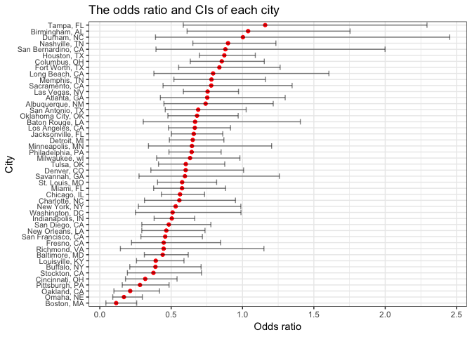

p8105\_hw6\_sl4471
================
Shwuei Liu
11/23/2018

Probelm 1
=========

``` r
homicides_data = 
  read_csv("./data/homicide-data.csv") %>% 
  janitor::clean_names() %>% 
  mutate(city_state = str_c(city, ", ",  state), 
         resolved = as.numeric(disposition == "Closed by arrest"), 
         victim_race = ifelse(victim_race == "White", "White", 
                              ifelse(!(victim_race == "White"), "Non-white", NA)),
         victim_race = fct_relevel(victim_race, "White"), 
         victim_age = as.numeric(victim_age)) %>% 
  filter(!(city_state %in% c("Dallas, TX", "Phoenix, AZ", "Kansas City, MO", "Tulsa, AL")))
```

    ## Parsed with column specification:
    ## cols(
    ##   uid = col_character(),
    ##   reported_date = col_integer(),
    ##   victim_last = col_character(),
    ##   victim_first = col_character(),
    ##   victim_race = col_character(),
    ##   victim_age = col_character(),
    ##   victim_sex = col_character(),
    ##   city = col_character(),
    ##   state = col_character(),
    ##   lat = col_double(),
    ##   lon = col_double(),
    ##   disposition = col_character()
    ## )

    ## Warning in evalq(as.numeric(victim_age), <environment>): NAs introduced by
    ## coercion

``` r
baltimore_fit = 
  homicides_data %>% 
  filter(city_state == "Baltimore, MD") %>% 
  glm(resolved ~ victim_age + victim_race + victim_sex, data = ., family = binomial())

baltimore_estimate =
  baltimore_fit %>% 
  broom::tidy()
```

``` r
baltimore_or = 
  baltimore_fit %>% 
  broom::tidy(conf.int = TRUE, exponentiate = TRUE) %>% 
  rename(OR = estimate) %>% 
  select(OR, conf.low, conf.high) %>% 
  bind_cols(baltimore_estimate, .) %>% 
  filter(term == "victim_raceNon-white") %>% 
  select(term, estimate, OR, conf.low, conf.high)

knitr::kable(baltimore_or, digits = 3)
```

| term                  |  estimate|     OR|  conf.low|  conf.high|
|:----------------------|---------:|------:|---------:|----------:|
| victim\_raceNon-white |     -0.82|  0.441|     0.312|       0.62|

``` r
glm_all = 
  homicides_data %>% 
  group_by(city_state) %>% 
  nest() %>% 
  mutate(model_glm = map(data, ~glm(resolved ~ victim_age + victim_race + victim_sex, 
                                 data = ., family = binomial())),
          tidy_glm = map(model_glm, broom::tidy), 
         ci_glm = map(model_glm, broom::confint_tidy)) %>% 
  select(-data, -model_glm) %>% 
  unnest() %>% 
  filter(term == "victim_raceNon-white") %>% 
  mutate(OR = exp(estimate), conf.low = exp(conf.low), conf.high = exp(conf.high)) %>% 
  select(city_state, OR, conf.low, conf.high)

glm_all
```

    ## # A tibble: 47 x 4
    ##    city_state         OR conf.low conf.high
    ##    <chr>           <dbl>    <dbl>     <dbl>
    ##  1 Albuquerque, NM 0.741   0.449      1.22 
    ##  2 Atlanta, GA     0.753   0.424      1.30 
    ##  3 Baltimore, MD   0.441   0.312      0.620
    ##  4 Baton Rouge, LA 0.668   0.304      1.41 
    ##  5 Birmingham, AL  1.04    0.612      1.75 
    ##  6 Boston, MA      0.115   0.0425     0.259
    ##  7 Buffalo, NY     0.390   0.210      0.710
    ##  8 Charlotte, NC   0.558   0.313      0.951
    ##  9 Chicago, IL     0.562   0.432      0.734
    ## 10 Cincinnati, OH  0.318   0.180      0.541
    ## # ... with 37 more rows

``` r
glm_all %>% 
  mutate(city_state = fct_reorder(city_state, OR)) %>% 
  ggplot(aes(x = city_state, y = OR)) +
  geom_point(color = "red") +
  geom_errorbar(aes(ymin = conf.low, ymax = conf.high), alpha = 0.5) +
  coord_flip() +
   labs(
    title = "The odds ratio and CIs of each city",
    x = "City",
    y = "Odds ratio") +
  theme(axis.text.y = element_text(size = 8, hjust = 1)) 
```



Problem 2
=========

``` r
birthweight = 
  read_csv("./data/birthweight.csv") %>% 
  janitor::clean_names() %>% 
  select(bwt, everything()) %>% 
  mutate(babysex = as.factor(ifelse(babysex == 1, "Male", "Female")), 
         frace = as.factor(ifelse(frace == 1, "White", 
                                  ifelse(frace == 2, "Black", 
                                         ifelse(frace == 3, "Asian", 
                                                ifelse(frace == 4,
                                                       "Puerto Rican", 
                                                       ifelse(frace == 8, "Other", 
                                                              ifelse(frace == 9, "Unknown",
                                                                     NA))))))),
         malform = as.factor(ifelse(malform == 0, "Absent", "Present")),
         mrace = as.factor(ifelse(mrace == 1, "White", 
                                  ifelse(mrace == 2, "Black", 
                                         ifelse(mrace == 3, "Asian", 
                                                ifelse(mrace == 4,
                                                       "Puerto Rican", 
                                                       ifelse(mrace == 8, "Other", NA)))))))
```

    ## Parsed with column specification:
    ## cols(
    ##   .default = col_integer(),
    ##   gaweeks = col_double(),
    ##   ppbmi = col_double(),
    ##   smoken = col_double()
    ## )

    ## See spec(...) for full column specifications.

``` r
table(is.na(birthweight))
```

    ## 
    ## FALSE 
    ## 86840
